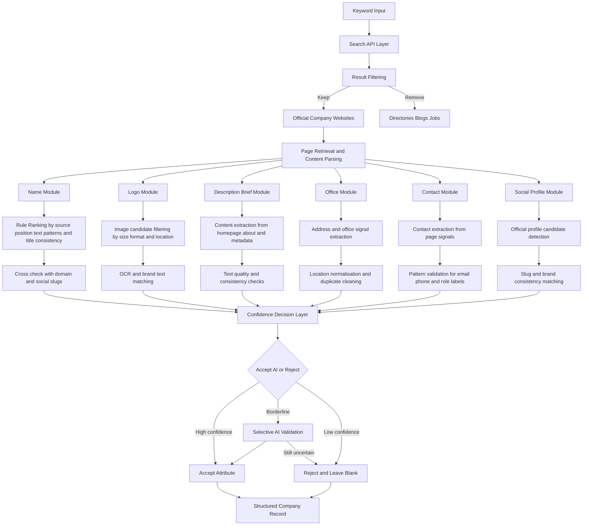

# Company-Enrichment-Pipeline-Case-Study
This repository demonstrates the design and implementation of a large-scale company enrichment pipeline built in a production environment.  
-  Note: Due to confidentiality, actual production code is not included.

## Project Overview

This project implements a scalable pipeline for automated company data enrichment, transforming raw search results into structured, high-confidence business records.

Unlike AI-heavy approaches, this system is built on a hybrid architecture that prioritises deterministic methods first (filtering, scoring, validation), and only leverages AI when necessary. The core goal is to achieve:

- High precision (minimise incorrect data)
- Low AI cost (minimise token usage)
- Scalability (handle large volumes of companies)

This makes the pipeline suitable for real-world database enrichment tasks where both accuracy and cost efficiency are critical.

## Pipeline Architecture

The pipeline is composed of three tightly integrated layers:

### 1. Discovery & Filtering

The system begins by querying search engines using domain-specific keywords (e.g. “law firm Melbourne”).

Raw search results are aggressively filtered to retain only:

- Official company websites
- Relevant industry matches

Noise is removed early, including:

- Directory listings
- Job pages
- Blogs and aggregator sites

This step is critical because **downstream quality is bounded by upstream precision**.

### 2. Parallel Enrichment (Multi-Agent Design)

Once a valid company website is identified, multiple enrichment agents run in parallel to extract structured attributes:

- Company name
- Description / brief
- Logo
- Office location
- Contact information
- Social media links
- ...

Each agent operates independently, which:

- Improves throughput
- Enables modular debugging
- Prevents single-point failure

This design allows the system to scale horizontally while maintaining flexibility.

### 3. Candidate Selection & Validation
#### (a) Heuristic Scoring

For fields with multiple candidates (e.g. name, logo), each candidate is ranked using a scoring system based on:

- Keyword relevance
- Source reliability (e.g. header > body > metadata)
- Context position (homepage vs embedded content)

This produces a ranked shortlist rather than a single guess.

#### (b) Cross-Source Validation

To improve confidence without AI, the system performs consistency checks across multiple signals:

- Logo OCR text ↔ company name
- Domain ↔ LinkedIn / social profile slug
- Description ↔ page title / metadata
- Agreement across multiple sources

This step significantly reduces false positives by ensuring **multi-signal alignment**, rather than trusting any single source.

#### (c) AI-Assisted Resolution (Fallback Only)

AI is used selectively when:

- Top candidates have similar scores
- Rule-based logic cannot confidently decide

Instead of generating data, AI is used for:

- Semantic comparison
- Consistency judgement

Design principle:

- AI is a “last-mile decision engine”, not the primary extraction method.

This approach dramatically reduces token usage while preserving high accuracy.

## Key Design Principles
### 1. Precision > Recall

The system prioritises correctness over completeness:

- Missing fields are acceptable
- Incorrect data is not
### 2. Multi-Signal Decision Making

- No single signal is trusted in isolation.
- All decisions are based on agreement across independent sources.

### 3. Cost-Aware AI Usage

AI is intentionally constrained:

- Never used in early stages
- Only triggered for ambiguous edge cases

This ensures the pipeline remains economically scalable.

4. Modular & Extensible Architecture

Each enrichment component is loosely coupled, making it easy to:

- Add new data sources
- Introduce new validation signals
- Replace individual agents without affecting the whole system

## Challenges & Engineering Solutions
### Noisy and Unstructured Web Data

Search results often contain irrelevant or low-quality pages.
→ Solved through strict filtering and domain validation at the entry point.

### Ambiguous Company Identity

Companies may have:

- Similar names
- Multiple branches
- Inconsistent branding

→ Solved through cross-validation using domain, content, and external profiles.

### Logo Extraction Complexity

Webpages contain many non-logo images.
→ Solved via:

- Size and format filtering
- OCR-based text matching
- Consistency checks with company identity

### AI Cost vs Accuracy Trade-off

Naively using AI for all decisions is expensive.
→ Solved by:

- Rule-first pipeline
- AI only for tie-breaking scenarios

## Outcome & Impact
- Automated enrichment of company records from raw search inputs
- High-confidence structured outputs suitable for database ingestion
- Significant reduction in AI usage through hybrid design
- Scalable architecture adaptable to multiple industries
